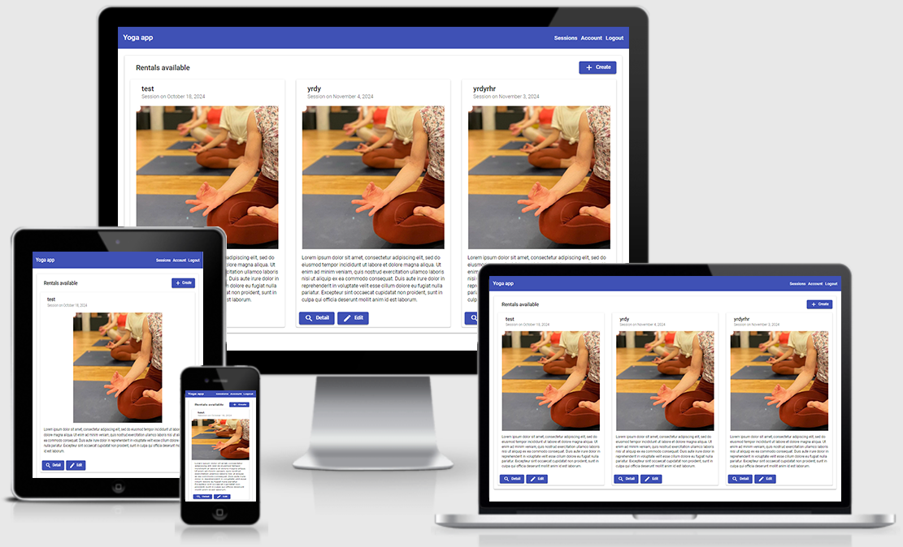

# Projet n°18 : Tester une application full-stack (partie front-end)

## :mag: Aperçu

## :bookmark_tabs: Sommaire

<ol>
    <li><a href="#sujet">Sujet</a></li>
    <li><a href="#demandes_respecter">Demandes à respecter</a></li>
    <li><a href="#objectifs_projet">Objectifs du projet</a></li>
    <li><a href="#technologies_utilisees">Technologies utilisées</a></li>
    <li><a href="#prerequis">Prérequis</a></li>
    <li><a href="#installation">Installation</a></li>
    <li><a href="#utilisation_siteweb">Utilisation du site web</a></li>
    <li><a href="#auteurs_contributeurs">Auteurs et contributeurs</a></li>
    <li><a href="#licence">Licence</a></li>
</ol>

## :page_facing_up: 1. Sujet 

Vous êtes développeur full-stack dans l’agence NumDev, spécialisée dans la création d'applications de gestion d’entreprise pour les petites entreprises locales.

De retour au bureau lundi, vous apprenez que votre collègue Cengiz vient d'être papa. Il vous envoie ce message :
J'ai vu avec ta manageuse et c'est toi qui va reprendre mon projet. Comme tu le sais, je suis devenu papa, mais le petit est arrivé un peu en avance ! Du coup ça va être à toi de prendre la relève, l'étape finale du projet, le testing.
Il s'agit d'une application de réservation pour Savasana, le studio yoga d'a côté, tu sais, où les autres vont faire leur sessions de yoga de temps en temps. Le projet est presque terminé.
La manageuse te contactera de suite avec les détails.

## :memo: 2. Demandes à respecter 

- Avoir fait les tests unitaires et d'intégration sur le front-end avec Jest ;
- Une couverture de test à au moins 80 % dont au minimum 30 % des tests doivent être des tests d'intégration sur la partie front-end ;
- Avoir fait les tests end-to-end avec Cypress ;
- Une couverture de test à au moins 80 % sur la partie end-to-end ;
- Avoir fait les tests unitaires et d'intégration sur le back-end avec Mockito ;
- Une couverture de test à au moins 80 % dont au minimum 30 % des tests doivent être des tests d'intégration sur la partie back-end.

## :checkered_flag: 3. Objectifs du projet 

- Apprendre à faire des tests unitaires, et d'intégration front-end avec Jest ;
- Apprendre à faire des tests end-to-end avec Cypress ;
- Apprendre à faire des tests unitaires, et d'intégration back-end avec Mockito.

## :computer: 4. Technologies utilisées 

- Angular
- Java
- Spring
- SQL
- Postman
- Jest
- Cypress
- Mockito
- Git & GitHub

## :exclamation: 5. Prérequis 

- Avoir MySQL d'installer sur son PC ;
- Avoir fait le necéssaire avec la partie back-end disponible ici : https://github.com/LancelleTimote/Projet-n-18-Tester-une-application-full-stack/tree/master/back

## :wrench: 6. Installation 

- Cloner ce repository ;
- Pour installer les différents packages, dans le terminal à partir du dossier front-end, exécuter npm install.

## :question: 7. Utilisation du site web 

- Dans le dossier ressources/sql vous trouverez la base de donnée script.sql à exécuter dans MySQL ;
- Une liste des différents endpoints est disponible pour Postman dans ressources/postman ;
- Dans le terminal à partir du dossier back-end, exécuter SpringBootSecurityJwtApplication présent dans src\main\java\com\openclassrooms\starterjwt ;
- Dans le terminal à partir du dossier front-end, exécuter npm start ;
- L'application est disponible a l'adresse suivante : http://localhost:4200/
- L'API s'exécute sur le port 8080 ;
- Il existe déjà des comptes, par défaut le compte administrateur est le suivant :
  login: yoga@studio.com
  password: test!1234
- Pour lancer la couverture de test Jest, dans le terminal à partir du dossier front-end, exécuter jest --coverage ;
- Pour démarrer Cypress, dans le terminal à partir du dossier front-end, exécuter npm run e2e ;
- Pour lancer la couverture de test Cypress, dans le terminal à partir du dossier front-end, exécuter npm run cypress:run, cela générera un fichier dans coverage/lcov-report/index.html qu'il vous faudra ouvrir dans votre navigateur. Attention veiller à avoir Cypress de démarrer en priorité, c'est à dire sur le port 4200, sinon vous n'aurez pas des résultats fiables car les tests seront exécutés indépendamment et non dans leur ensemble ;
- Pour lancer la couverture de test Mockito, dans le terminal à partir du dossier back-end, exécuter mvn clean install, cela générera un fichier dans target/site/jacoco/index.html qu'il vous faudra ouvrir dans votre navigateur.

## :beers: 8. Auteurs et Contributeurs 

Timoté Lancelle : [GitHub](https://github.com/LancelleTimote) / [LinkedIn](https://www.linkedin.com/in/timote-lancelle-devweb/)

## :page_with_curl: 9. Licence 

Distribué sous la licence MIT. Voir le fichier [LICENSE](LICENSE) pour plus d'informations.
